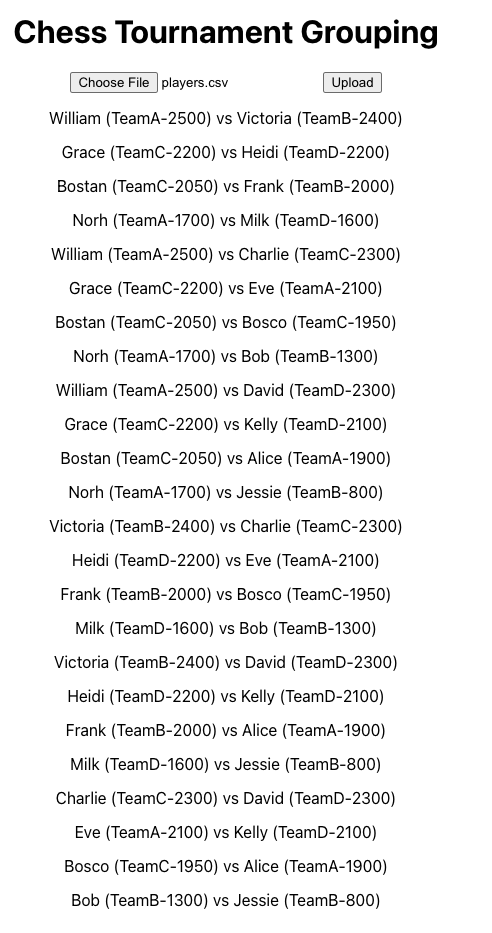

## Chess tournament pairing app
A small program that generates pairings for a chess tournament. Intended for informal settings (e.g., chess clubs, inter-school tournaments).

Pairings are optimized based on a set of prioritized criteria:

* Two players should not be paired in the same team.
* Two players should not be paired together more than once
* Opponents should have similar rankings
    - Team 1's highest-ranking player should face Team 2's highest-ranking player.
    - Team 1's second highest-ranking player should face Team 2's second highest-ranking player.

[Example players csv](https://github.com/WilliamZhang9/chess-tournament-pairing/blob/main/players.csv) 

## Screenshot

## Start Node Server
##### cd server
##### nmp start

## Start Client
##### cd client
##### nmp start

